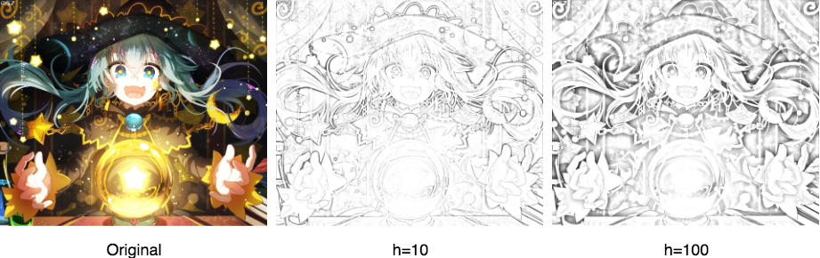
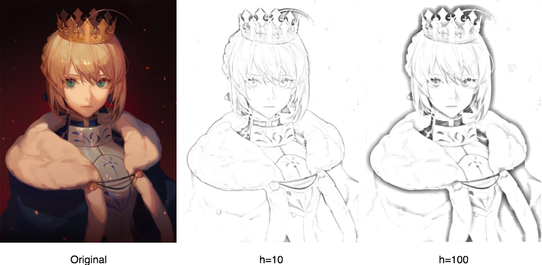
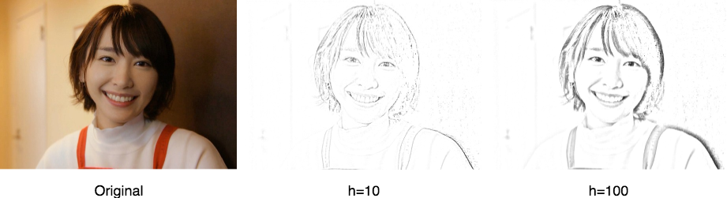

# ImageSketched
An easy way to sketch images.

## Algorithm

1. Read image as `img1`, and copy it as `img2`.
2. Invert the color of `img2`.
3. Use Gaussian Blur to process `img2`, the **kernel size** and **standard deviation** will affect the result.
4. Blend `img1` and `img2` by using **Color Dodge**.
5. Using Non-local Means Denoising algorithm to denoise.

## Function

### SketchImage
**Parameters**
`img`: the image you want to sketch.
`ksize`: Kernel size of Gaussian Blur.
`sigmaX`: Standard deviation in X direction.
`sigmaY`: Standard deviation in X direction.
`h`: Parameter regulating filter strength.
`templateWindowSize`: Size in pixels of the template patch that is used to compute weights.
`searchWindowSize`:Size in pixels of the window that is used to compute weighted average for given pixel.
**Return**
The sketched image.

Click [here](https://docs.opencv.org/3.1.0/d4/d86/group__imgproc__filter.html#gaabe8c836e97159a9193fb0b11ac52cf1) for more details of `ksize`, `sigmaX` and `sigmaY`.
Click [here](https://docs.opencv.org/3.0-beta/modules/photo/doc/denoising.html) for more details of `h`, `templateWindowSize` and `searchWindowSize`.

## Samples

